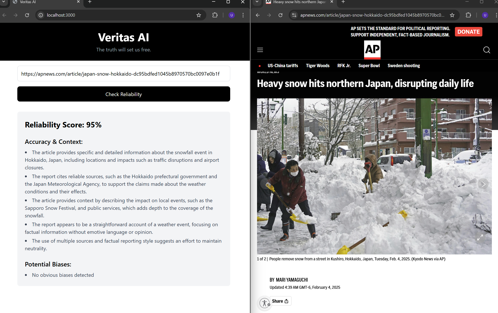
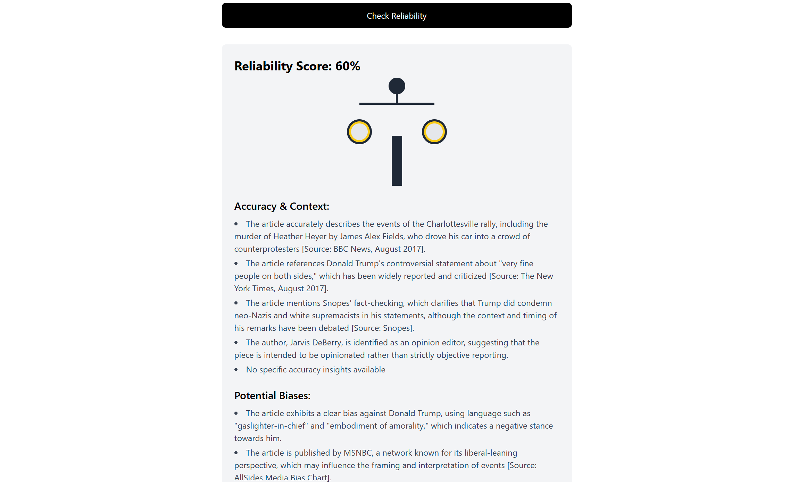
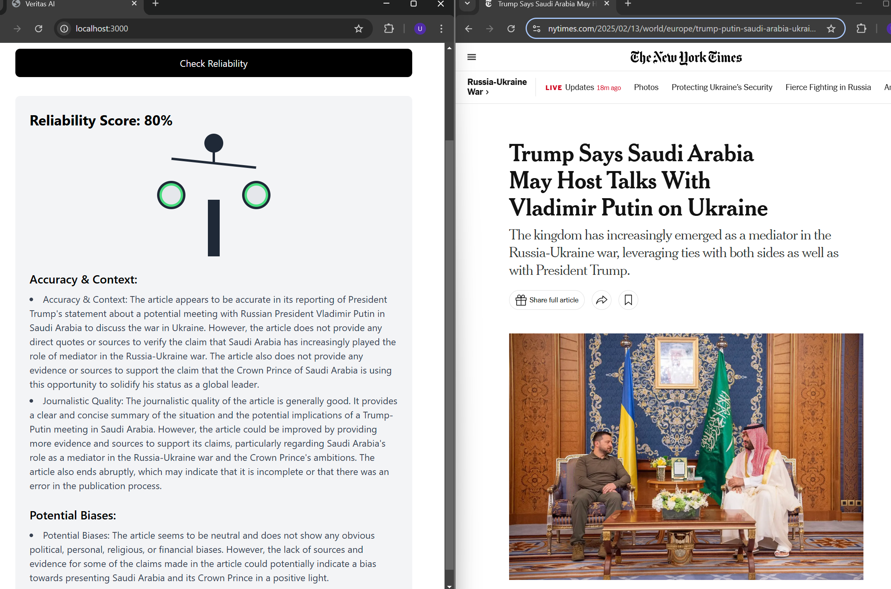

# Veritas AI

**Veritas AI** is an intelligent AI media fact-checking tool and bias detector that analyzes the reliability of online articles. It helps users determine the trustworthiness of content by providing a reliability score and insights. 

This project has been good practice for me to learn about incorporating AI like gpt-4o in simple web applications.

## Examples




## Features
- **URL Analysis**: Input a URL to check the reliability of a news article. The reliability score is out of 100 (< 50 = red, 50-75 = amber, > 75 = green).
- **AI-Powered Insights**: Get detailed insights into the article's credibility and potential biases (political, religious, personal, etc). 
- **User-Friendly Interface**: Simple and intuitive design for easy and frequent use. 

## How to Use

### Prerequisites
- Node.js (v16 or higher)
- npm (v8 or higher)
- OpenAI API key and .env file

### Setup

1. **Clone the Repository**:
   ```bash
   git clone https://github.com/UUHakusho/veritas-ai.git
   cd veritas-ai
   ```

2. **Install Dependencies**:
   - For the **frontend**:
     ```bash
     cd frontend
     npm install
     ```
   - For the **backend**:
     ```bash
     cd backend
     npm install
     ```

3. **Run the Backend Server**:
   - Navigate to the `backend` directory:
     ```bash
     cd backend
     npm start
     ```
   - The backend will start at `http://localhost:5000`.

4. **Run the Frontend**:
   - Navigate to the `frontend` directory:
     ```bash
     cd frontend
     npm start
     ```
   - The frontend will open in your browser at `http://localhost:3000`.

5. **Use the App**:
   - Paste a URL into the input field and click **Check Reliability** to see the analysis.

## Tech Stack

Frontend:
- React.js
- Tailwind CSS
- JavaScript

Backend:
- Node.js
- Express.js
- CORS middleware

AI:
- OpenAI API
- gpt-4o

## Future Improvements
- Add a database to store user data and analysis history
- Design a better UI/UX
- Allow insights to be shared on social media
- Fine-tune an AI model on bias and misinformation detection rather than using OpenAI
- Program should be able to scan articles, social media posts, blogs, pdfs, scholarly papers, and videos.